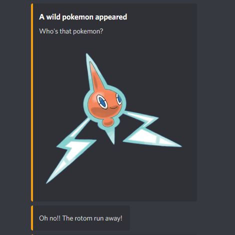

# pokemon-bot
This is a bot pokemon for discord.

[Click here if you want to join in your official discord server](https://discord.gg/n6DSgXSqrn)



## Features
- [x] Spawn pokemon (Currently, we have a cron job with webhook to spawn pokemon)
- [x] Training your pokemon
- [x] Trade pokemon with other trainers
- [ ] Some battle system
- [ ] Evolve pokemon

## Install & Running locally
You need `git` and `yarn` installed to run locally.

### Installing
```sh
yarn
```

### Running Locally
To run locally, you need setup some environment variables or create a `.env` file in root.

After set variables, run command
```sh
yarn dev
```

#### Variables
- `DISCORD_TOKEN`: Provided by discord [[1]](#1-you-can-learn-more-about-discord-applications-and-what-is-this-value-in-discord-documentation)
- `DISCORD_CLIENT_ID`: Provided by discord [[1]](#1-you-can-learn-more-about-discord-applications-and-what-is-this-value-in-discord-documentation)
- `DISCORD_CLIENT_SECRET`: Provided by discord [[1]](#1-you-can-learn-more-about-discord-applications-and-what-is-this-value-in-discord-documentation)
- `DB_MONGO_URL`: URL to connect to mongodb instance
- `CALLABLE_POKEMON`: A key to permit use `/call` endpoint
- `FRONTEND_URL`: Optional, if you want some commands have link
- `DEVMODE`: Optional, for security development, set this variable with any value

##### [1] You can learn more about discord applications and what is this value in (discord documentation)[https://discord.com/developers/docs/game-sdk/applications]

## Contributing
If you'd like to make your own changes, feel free to submit a pull request, and ensure your PR is made against the 'dev' branch.
